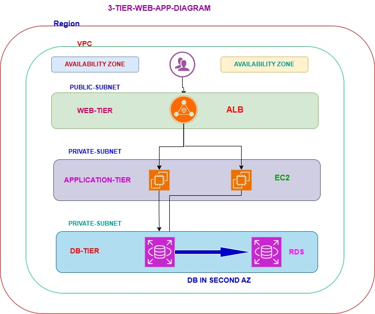

# AWS 3-Tier Web Application Architecture

## Project Overview
This project demonstrates deployment of a secure and highly available 3-tier web application architecture on AWS.

## AWS Services Used
- Amazon VPC
- EC2
- Application Load Balancer (ALB)
- RDS MySQL
- NAT Gateway
- Internet Gateway
- Bastion Host
- Security Groups

---

## Architecture Diagram



---

## Architecture Explanation

### Web Tier
- Hosted in Public Subnets
- Uses Application Load Balancer
- Receives user traffic

### Application Tier
- EC2 instances in Private Subnets
- Apache + PHP installed
- Handles application logic

### Database Tier
- Amazon RDS MySQL
- Multi-AZ deployment
- Hosted in Private Subnets

## Key Concepts Demonstrated
- Network segmentation and security
- High availability across multiple AZs
- Secure access using Bastion Host
- Load balancing with ALB
- Managed database with RDS

---

---

## Project Steps
1. Created VPC with CIDR 10.0.0.0/16
2. Set up 9 subnets across 3 Availability Zones
3. Configured Route Tables, IGW, and NAT Gateway
4. Deployed Bastion Host for secure access
5. Installed LAMP stack on App Servers
6. Configured ALB with Target Groups
7. Set up RDS MySQL with Multi-AZ and phpMyAdmin
Detailed implementation steps available in:

```
project-steps.txt
```

---

## Author
Gadala Shyam
DevOps & Cloud Enthusiast
